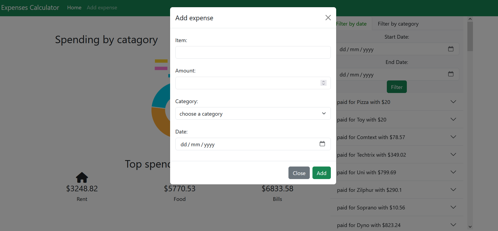
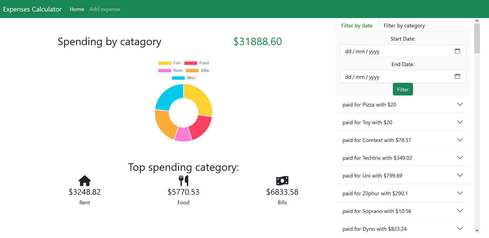

# Expense Tracker

[](https://opensource.org/licenses/MIT)

## Overview

Expense Tracker is a simple and efficient tool designed to help individuals track their expenses and manage their finances. It provides a user-friendly interface for recording transactions, categorizing expenses, and generating reports.

## Features

- **Transaction Logging:** Record expenses with ease.
- **Category Management:** Categorize your transactions for better organization.
- **Reports:** View and analyze your spending patterns through date reports.
- **Filter by Category:** Easily filter transactions based on categories.
- **Filter by Date:** Conveniently view transactions within a specific date range.
- **User-Friendly Interface:** Simple and intuitive design for a seamless user experience.

## Installation

1. Clone the repository:

    ```bash
    git clone https://github.com/andalusm/expenses.git
    ```

2. Navigate to the project directory:

    ```bash
    cd expenses
    ```

3. Install dependencies:

    ```bash
    npm install
    ```

4. Configure the application by setting up environment variables or configuration files.

5. Start the application:

    ```bash
    node server.js
    ```

6. Access the application in your web browser at [http://localhost:4200](http://localhost:4200).

## Usage

1. Add transactions by providing details such as amount, category, and description.
2. Explore the reports section to gain insights into your spending habits.
3. Filter transactions by category or date to focus on specific sets of data.

## Screenshots



## License

This project is licensed under the [MIT License](LICENSE).
